# aSim device model — seam, core state machine, substrate

How aSim substitutes for the AICore fabric: the register contract it must
honour, the per-core state machine it advances, and how the `a2a3asim`
variant is built. Landing page: [DESIGN.md](DESIGN.md).

## 3. The seam (where aSim substitutes for hardware)

The scheduler touches a compute core through exactly two memory-mapped
registers (paper §2.2), which aSim substitutes for:

| Register / op | Today (real a2a3) | Under aSim |
| ------------- | ----------------- | ---------- |
| **Push register** — AICPU writes the task’s unique ID to dispatch it | `write_reg(h.reg_addr, RegId::DATA_MAIN_BASE, reg_task_id)` (`scheduler_context.h`) | accept the pushed task into the core’s state machine (§4a); schedule its ACK and FIN real-time deadlines |
| **Status register** — AICPU reads `(last_updated_task_id, status)`; status ∈ {Uninitialized, Busy/Acknowledged, Idle/Finished} | `read_reg(RegId::COND)` / `*core.cond_ptr` (ACK then FIN, task-id-encoded) | return the core’s current `(task_id, status)` evaluated against the real clock |

aSim replaces the implementation *behind* `read_reg`/`write_reg` (or the thin
core-status accessor), not the scheduler’s call sites. That register interface is
the contract. Keeping the substitution at this exact layer is what lets the
scheduler be used unmodified.

Measured MMIO latencies (paper §2.2): **~77 ns** to read the status register,
**~64 ns** to push a task. Our own a2a3 sampling puts the completion poll at
~92 ns `nGnRE` — same order; aSim calibrates to locally-sampled values.

### Wire encoding (the one contract aSim must match to the bit)

From `src/a2a3/platform/include/common/platform_config.h`. aSim must emit the
exact same 32-bit `COND` word the real AICore writes, and decode the same
`DATA_MAIN_BASE` push the scheduler writes.

**Status register (`COND`)** — `[bit 31: state | bits 30..0: task_id]`:

| Field | Bits | Mask |
| ----- | ---- | ---- |
| task_id | 0–30 | `TASK_ID_MASK = 0x7FFFFFFF` |
| state   | 31   | `TASK_STATE_MASK = 0x80000000` |

- state = 0 → **ACK** (task received), state = 1 → **FIN** (task completed).
- `MAKE_ACK_VALUE(id) = id & 0x7FFFFFFF`
- `MAKE_FIN_VALUE(id) = (id & 0x7FFFFFFF) | 0x80000000`
- decode: `EXTRACT_TASK_ID = w & 0x7FFFFFFF`, `EXTRACT_TASK_STATE = (w>>31)&1`

**Reserved task IDs** (never real tasks; valid task IDs are `0 .. 0x7FFFFFEF`):

| Name | Value | Meaning |
| ---- | ----- | ------- |
| `AICPU_IDLE_TASK_ID` | `0x7FFFFFFD` | AICPU writes to `DATA_MAIN_BASE` to *open the window* (core may start) |
| `AICORE_EXIT_SIGNAL` | `0x7FFFFFF0` | AICPU writes to `DATA_MAIN_BASE` to tell the core to exit |
| `AICORE_IDLE_VALUE`  | `MAKE_FIN_VALUE(0x7FFFFFFF)` = `0xFFFFFFFF` | core writes to `COND` at init: initialized / idle |
| `AICORE_EXITED_VALUE`| `MAKE_FIN_VALUE(0x7FFFFFFE)` = `0xFFFFFFFE` | core writes to `COND`: has exited |

**Push register (`DATA_MAIN_BASE`)**, 64-bit. Low 32 carry the dispatched task
id (or a sentinel above); `0` means the window is closed (core waits). The
high 32 are the early-dispatch doorbell (`== task_id` releases a gated task) —
**out of scope for M0.**

Real sequence per task (aicore_executor.cpp): scheduler writes
`DATA_MAIN_BASE = task_id`; core writes `COND = MAKE_ACK_VALUE(task_id)`, runs,
then `COND = MAKE_FIN_VALUE(task_id)`. aSim reproduces exactly this word
sequence, timed by §4a.

### The seam is a function call, not a mapped load/store (DECIDED)

On real hardware both ops are *passive* accesses to mapped addresses — a plain
load/store the driver’s MMIO fabric services. aSim cannot be passive: the
status read must *do work* (evaluate `cntvct`, advance the core state machine,
return the maybe-updated word). So the seam is replaced by **function calls** —
the single sanctioned change to the scheduler’s device-access layer:

- **push** — `asim_push(core, task_id)` — *mutates* aSim state: admit the task
  into the core’s machine, schedule its ACK/FIN deadlines (§4a). Charges the
  push latency inline (busy-spin).
- **status read** — `asim_read_status(core) -> uint32_t` — evaluates the clock,
  advances the machine to `now`, returns the current `COND` word. Charges the
  status-read latency inline.

Both charge their MMIO latency *inside the call* so Mode A fidelity holds.

The clean substitution point is `read_reg`/`write_reg` (`platform_regs.cpp`).
**Caveat:** some scheduler sites bypass those and poke the mapped pointer
directly via `get_reg_ptr(...)`. Those direct pokes must be routed through the
`asim_*` calls too — a passive `*ptr = v` / `v = *ptr` cannot trigger aSim’s
active response.

### Porting surface (the AICPU side aSim must service)

> The file:line references below were enumerated against `host_build_graph`.
> `scan_and_claim` forked from it and its seam is identical in shape — same five
> sites, same access forms, same distribution across the same five files — so the
> table still describes the surface accurately, but the line numbers have drifted.

Enumerated from the scheduler tree (the AICore side, `aicore/aicore_executor
.cpp`, is *not* ported — aSim replaces it entirely). The surface is small:

| Site | Op | Access form | M0? |
| ---- | -- | ----------- | --- |
| `scheduler_completion.cpp:289` `uint64_t reg_val = *core.cond_ptr` | status read (**hot** completion poll) | **direct passive deref** → must become `asim_read_status(core)` | **yes — the key conversion** |
| `scheduler_context.h:346` `write_reg(DATA_MAIN_BASE, reg_task_id)` | push (dispatch) | via `write_reg` | yes |
| `scheduler_cold_path.cpp:155` `read_reg(COND)` | status read (cold / handshake) | via `read_reg` | yes |
| `scheduler_cold_path.cpp:671` `st.cond_ptr = get_reg_ptr(reg_addr, COND)` | resolve the per-core status handle once | `get_reg_ptr` | yes — repoint to the aSim core handle |
| `scheduler.h:721` `*dmb = …` (`get_reg_ptr(DATA_MAIN_BASE)`) | early-dispatch doorbell (high-32) | direct passive write | no — early-dispatch off at M0 |

`core.cond_ptr` is `volatile uint32_t*` (`scheduler_types.h:120`), resolved once
per core in the handshake, then hot-derefed each poll (the raw deref at :289 is
a deliberate optimization over `read_reg`, with a following `rmb()`). aSim keys
its per-core state machine off the core handle; how `cond_ptr` is repurposed
(carry a core index vs. map pointer→core) is settled with the backend
integration mechanism.

## 4a. Per-core device model — the compute-core state machine (paper §2.3)

aSim must reflect the Ascend compute-core state machine faithfully; this is the
heart of the device model. Each core is a **2-deep pipeline**: it holds at most
an **active** task and a **pushed** (pipelined) task. Per core, aSim tracks:

- `active`  = `{task_id, ack_at, fin_at}` (absolute `cntvct` deadlines) or empty
- `pushed`  = `{task_id, admitted_at}` or empty
- the status register it exposes: `(last_updated_task_id, status ∈ {Uninit,
  Acknowledged, Finished})`

**Timing rules (Mode A, real clock):**

- A push into an **idle** core (Fully Free): the task becomes active; `ack_at =
  now + t_ack` (near-immediate — an idle core reads the register at once),
  `fin_at = ack_at + sampled_compute`.
- A push into a core with a **running active** task (Partially Free → Fully
  Busy): the pushed task waits; it is **not** acknowledged until the active task
  finishes, at which point the core **auto-acks** it and it becomes active
  (`ack_at = active.fin_at`, `fin_at = ack_at + sampled_compute`).
- A status read returns whichever event (ACK or FIN) the machine has reached by
  `cntvct` now, task-id-tagged, exactly as the real ACK-then-FIN sequence.

**Four steady states** (2 slots × {acked, finished}):

| State | active | pushed |
| ----- | ------ | ------ |
| Fully Free | — | — |
| Partially Busy | — | pushed, not yet acked |
| Partially Free | running | — |
| Fully Busy | running | pushed |

**Transitions aSim must reproduce (as the AICPU observes them):**

- Fully Free → Partially Busy: AICPU pushes; ACK not yet observed.
- Partially Busy → Partially Free: core acked the task (now active); AICPU read
  the ACK → may push another.
- Partially Busy → Fully Free: core finished the task before the AICPU’s next
  status read (push→ack→fin fell between two polls).
- Partially Free → Fully Free: active finished; AICPU read the FIN.
- Partially Free → Fully Busy: AICPU pushes a second task.
- Fully Busy → Partially Free: pushed task acked ⇒ the first (active) task
  finished (auto-ack on active-finish).
- Fully Busy → Fully Free: pushed task finished ⇒ active also finished.

**Forbidden transitions (must NOT be generable):**

- Fully Busy → Partially Busy — the core auto-acks the pipelined task the instant
  the active one finishes, so it never sits pushed-but-unacked with no active.
- Partially Busy → Fully Busy — pushing a second task before the first is acked
  would overwrite the first; the scheduler must not do it, and aSim treats a push
  into a not-yet-acked `pushed` slot as a fidelity violation (assert/log).

The pipelining rule — *a new task may be pushed only after the prior is
acknowledged* — is exactly what the injected ~64 ns/77 ns latencies make worth
modeling: ACK lets the next push overlap the active task’s compute (Fig.
“pipelinedTask”).

## 4b. How the platform backends work (what aSim builds on)

Mapped from the a2a3 tree:

- **`read_reg`/`write_reg`/`get_reg_ptr` are shared** (`platform/shared/aicpu/
  platform_regs.cpp`). The onboard↔sim split is one level down in
  `reg_load_acquire`/`reg_store_release` (`platform/{onboard,sim}/aicpu/
  inner_platform_regs.cpp`): onboard = raw Device-nGnRnE MMIO deref; sim =
  `__atomic_load/store` over shared host memory.
- **Backend selection** is by platform string → variant → platform source dir
  (`platform_info.py`, `runtime_compiler.py`): `a2a3`→`platform/onboard`,
  `a2a3sim`→`platform/sim`. The **runtime** sources (scheduler, and the same
  `aicore/aicore_executor.cpp`) compile into *both*.
- **The sim backend does not model timing and has no bespoke core emulator.**
  It compiles the *real* `aicore_executor.cpp` into a host `.so` and runs **one
  host `std::thread` per core** (`sim/host/device_runner.cpp`), registers are
  plain host memory, and a task "finishes" when the real kernel function
  returns. `device_wall` is a host wall-clock delta.

**Consequence:** aSim is the sim backend plus two changes —
1. the per-core executor thread **spins the sampled compute duration** (cntvct
   deadline) instead of calling the real kernel (this thread is the concurrent
   core "deadline" of §4-pillar-1, correctly on the core's own thread);
2. the AICPU reg path **injects the MMIO latency** (busy-spin) on COND reads and
   DATA_MAIN_BASE pushes — plus the one hot `*core.cond_ptr`→`asim_read_status`
   conversion (§3 porting surface) so the read is active.

## 4c. Substrate — DECIDED: onboard / real-AICPU

The scheduler runs on the **real device AICPU** for maximum fidelity — the
scheduler's own compute is incurred at true AICPU speed, not a host stand-in.
aSim is a **new onboard-based variant**, not an extension of the host `a2a3sim`
backend.

This forces the core model (and it is the clean one): the AICPU has only ~6
usable cores, all running the scheduler's dispatch threads, and no real AICores
run. So the simulated cores are **not threads** — they are **passive per-core
state machines advanced lazily inside `asim_read_status`** (evaluate `cntvct`
against `ack_at`/`fin_at`, §4a). Compute duration elapses in real wall-clock
because `fin_at = push_time + submit_lat + sampled_compute` and real time passes
as the scheduler does other work; no thread spins it. This is exactly
§4-pillar-1, and it supersedes the per-core-thread shape the host sim backend
happens to use (§4b) — that shape was the not-chosen alternative.

### Onboard bring-up deltas (vs the stock onboard path)

1. **Do not launch the AICore kernel.** No real cores; aSim replaces them.
2. **Point the scheduler's core registers at aSim memory, not the MMIO SPR
   window.** aSim allocates per-core register backing (like the sim
   `reg_blocks`); `reg_base` for each core addresses aSim memory. Reads/writes
   become cacheable, and the injected latency (§4-pillar-2) restores the real
   MMIO cost.
3. **Seed each core's `COND` to `AICORE_IDLE_VALUE`** so the bring-up handshake
   (which waits for cores to report idle) completes without real cores.
4. **Convert the hot `*core.cond_ptr` read to `asim_read_status(core)`** (§3),
   so the poll actively advances the state machine; keep the cold-path handshake
   reads working against the seeded idle value.

This still needs a device + `task-submit` (it occupies the AICPU op), but no
AICore/HBM compute.

## 4d. Onboard bring-up wiring plan (M0)

Mapped from the onboard path. aSim is an **onboard-family** variant (real
onboard host + real aarch64 AICPU scheduler), differing only in that no real
AICore runs and the core registers are aSim-owned memory.

**Register provisioning.** Onboard fills `args.regs` = device array of per-core
MMIO SPR bases from the driver (`halMemCtl`, `host_regs.cpp`), handed to the
AICPU via `set_platform_regs` → `g_platform_regs`. The scheduler captures
`CoreExecState.reg_addr = regs[physical_core_id]` in the handshake
(`scheduler_cold_path.cpp:643`). **aSim substitutes aSim-owned backing memory
for those bases** (the analog of the sim backend's `reg_blocks`), and calls
`asim::configure(reg_base, num_cores)` so the addr↔index map matches.

**The readiness gate is `hank->aicore_done`, not COND** — and the handshake
sweep spins on it **with no timeout** (`scheduler_cold_path.cpp:623-646`); the
leader then barriers on all slices. So aSim **must publish, for every worker
slot `i` in `runtime->workers[0..worker_count)`**: `physical_core_id` (valid,
`< platform_get_physical_cores_count()`), `core_type`, then `aicore_done = i+1`
(with the same store-barrier/flush ordering the real AICore uses at
`aicore_executor.cpp:79-83`), and seed each core's `COND = AICORE_IDLE_VALUE`.
This is the piece that replaces the real AICore's launch-time self-report;
without it the AICPU hangs in the preamble (→ op-execute-timeout kill).

**Bring-up deltas, concretely:**
1. Host (`asim/host/device_runner.cpp`): **skip `launch_aicore_kernel`**;
   provision aSim reg backing instead of `init_aicore_register_addresses`’ MMIO
   map; still launch the AICPU kernel.
2. AICPU: before/at handshake, an aSim bring-up publishes each worker’s
   `aicore_done`/`physical_core_id`/`core_type` and seeds COND idle, then
   `asim::configure`/`set_latencies_ns`/`set_compute_ns`/`init`.
3. Seam (guarded by `__ASIM_DEVICE__`, the sanctioned variant macro): the hot
   `*core.cond_ptr` → `asim_read_status`, the `write_reg(DATA_MAIN_BASE)` →
   `asim_push`.

## 4e. Build scaffolding for the `a2a3asim` variant

**Integration: reuse the onboard platform dir + a variant macro, not a parallel
tree.** A duplicated `platform/asim/{aicpu,aicore,host}` tree would be ~all of
onboard copied and drift out of sync. Instead the `a2a3asim` variant compiles
the **onboard** platform sources with `-D__ASIM_DEVICE__`, gating the small
deltas in place (`device_runner.cpp`, `aicpu/kernel.cpp`, and the scheduler
seam). `asim_core.{h,cpp}` live in `platform/asim/aicpu/` and are added to the
aicpu build only under the variant (a `-DASIM_DEVICE=ON` cmake flag adds the
source + `__ASIM_DEVICE__`). Its binaries still land in `build/lib/a2a3/asim/`
(variant = `asim`), so onboard is never clobbered.

Build wiring (`simpler_setup/`):
- `platform_info.py`: `"a2a3asim": ("a2a3", "asim")`.
- `runtime_compiler.py`: map `a2a3asim` → platform dir `src/a2a3/platform/
  onboard`, add `_init_a2a3asim` mirroring **`_init_a2a3`** but passing
  `-DASIM_DEVICE=ON` to the aicpu (and host) targets. (The real AICore `.o` is
  still built — harmless, just never launched — so `_init_a2a3asim` can reuse
  `_init_a2a3` wholesale plus the flag.)
- Small `if(ASIM_DEVICE)` blocks in `onboard/aicpu/CMakeLists.txt` (add
  `../../asim/aicpu/asim_core.cpp` + its include dir + `-D__ASIM_DEVICE__`) and
  `onboard/host/CMakeLists.txt` (`-D__ASIM_DEVICE__`).

**Name trap (must handle):** `"a2a3asim".endswith("sim")` is `True`. Several
build-script checks use `platform.endswith("sim")` to mean “host-sim build”
(host g++, sim in-core dir, `cpu_sim_context`) — all **wrong** for aSim. Prefer
the robust variant-equality form `parse_platform(p)[1] == "sim"` (already used in
`build_runtimes.py:155`); fix the fragile `endswith("sim")` site in
`kernel_compiler.py:271`, and add `a2a3asim` to the explicit
`in ("a2a3","a2a3sim")` tuples that select a2a3 handling.

## 5. The GroupQueue (the M2 structure)

The GroupQueue is the hardware structure aSim exists to evaluate. It replaces
`push(core, task)` / `read_status(core)` with `submit(task)` /
`read_watermark()`, so the manager stops owning cores in both directions: it
does not choose one to dispatch to, and it does not ask one whether it is done.

The queue is a **centralized controller**, not an arbiter between bidders. It
holds every one of its cores' states itself, learns each transition from that
core's own ACK and FIN, and pushes work out the moment a core can take it.

### Topology

24 AI packages are split into **4 contiguous groups of 6**, one per AICPU
scheduler thread. Each group has one queue, and the thread that owns it is its
**manager**. Contiguity is not cosmetic: a queue sits physically beside the
packages it serves, and the latency budget below assumes that adjacency.

Each package is 1 AIC + 2 AIV that share local memory. It is **not** a
scheduling unit: the queue is the group's one controller and drives all 18 cores
directly. The package matters only because a mix task's halves share that local
memory, so a mix group has to land wholly inside one.

### Each manager owns its queue outright

A queue's packages, cores, ring and completion accounting live in one structure
that exactly one AICPU scheduler reads or writes. Nothing is shared and nothing
is atomic. That is the design's point rather than a convenience: a structure
shared between schedulers would need them to arbitrate for it, and a lock between
AICPUs costs more than the work it guards — the alternative, giving one core the
whole job, just moves the cost into a serial bottleneck.

### The device is an event schedule, not a machine that is advanced

A task's end is computed once, at the instant it is pushed to a core: the core is a
sequential server with a two-deep intake, so `end = max(core free, entry arrived)
+ ack + compute` is known then and never revisited. A poll compares the clock
against the soonest end it holds. Nothing is simulated in between.

This is what keeps aSim's own cost inside the latency it models. Advancing a
state machine on every access instead costs work proportional to the machine
rather than to what happened, which on this device was 74× the poll latency it
was supposed to hide under — see [validation.md](validation.md).

### Core state, held by the controller

Every core is in exactly one of three states, and two of them are sets the
controller can draw a target from:

| state | meaning | takes a task? |
| ----- | ------- | ------------- |
| free | nothing committed | yes, starting now |
| running | one task committed, pipeline slot open | yes, starting when that task ends |
| full | two committed, or holding an unstarted cohort member | no |

An **ACK** moves a core out of *free*, a **FIN** moves it back toward it. The
states are held as sets rather than derived, so picking a target is a priority
encode instead of a walk over every package on every task — and the count of
wholly-free packages, which the manager reads on every poll, is a load rather
than a sweep.

### Placement

Only each ring's **head** is pushed. A head that has nowhere to go stalls that
ring behind it — that is the design's head-of-line behaviour, not an artefact of
modelling it.

A cube or vector task goes to a **free** core of its type, chosen by a rotating
priority encode so work spreads across the group's packages. Only when every core
of that type is running does it go into a **pipeline** slot, and then behind the
core that frees soonest.

The two tiers are ordered rather than collapsed into one earliest-start rule. A
task landing on an idle core waits the full push-to-latch handshake (`ack`, 628
ns), where one dropped into a pipeline slot is latched the instant the running
task ends; an earliest-start rule would therefore pipeline behind a core about to
finish and leave an idle core standing.

The rotation advances **on a successful push**, never on the clock, so placement
is reproducible and does not depend on when a poll happens to land — which is
what keeps the simulator's own overhead out of the simulated outcome.

### A mix task is a group of consecutive entries

A MIX block is submitted as one cube entry followed by its vector halves. The
cube carries the marker that opens the group and the count of entries in it.

A group lands on a package **every one of whose cores has a slot**. The halves
then start as each core frees, one behind whatever is running there, so a mix does
not wait for a wholly idle package. A package with all three cores idle takes it
first; failing that, the one whose last half would start earliest. The controller
pushes the entries one at a time, so they do not start at the same instant: each
is a push behind the one before it and pays its own trip to the core.

| path | ns |
| ---- | -- |
| controller's push, per entry | 5 |
| controller → core, per entry | 60 |

Placement follows an entry's own type rather than its position in the group, so a
group carrying only one vector half still puts its cube on the cube core.

### Completion

A core finishing sets its position's bit in the queue; the queue publishes the
**contiguous prefix** over those bits as a watermark in one control register.
One read of that register retires everything it covers, which is what replaces
asking each core in turn. An out-of-order finish simply waits for its prefix.

### Latencies

Every path between two structures, with the value aSim injects. **Bold** paths
occupy the AICPU — they are the only ones that cost the scheduler wall time.
Everything else is a *visibility* delay: it changes when something can start or be
seen, without holding the thread.

**The values shown are the calibrated ones, which is what every run uses.** A
calibration file's `LAT` line supplies `push read ack notice`, and both validation
cases do: `5 195 1209 140` for qwen, `5 195 1119 80` for Case1.

#### `ack` is three sequential costs, and only one of them is about distance

`ack` spans push → kernel start. aSim never injects it as one edge, because the
two arms differ in only the first of its three terms:

| term | ns | what it is |
| ---- | -- | ---------- |
| arrival | 310 (AICPU) / 30 (controller) | the store lands on the core |
| **entry poll** | **318** | the core's spin loop gets round to reading it |
| pick-up | `ack` − 628 = 491 (Case1) / 581 (qwen) | dcci + ack + kernel entry |

The split is anchored on the microbenchmark's three readings of the *same* MMIO
submit: **5 ns** posted, **310 ns** barrier-forced complete, **633 ns** observed
by the target core. The 323 ns between the last two is the core getting round to
its next read — and it is the only row in that table with real jitter (±236,
CV 37%, against sd ≈ 0 for the transport rows), which is a phase offset against a
spin period rather than a transport cost.

The entry poll does **not** overlap pick-up. `receive_time` is stamped inside the
branch that already fired on a changed register
(`scan_and_claim/aicore/aicore_executor.cpp`), so `receive_to_start_cycles` starts
at the poll that noticed, not at the poll loop's start.

**The entry poll is core-intrinsic and both arms pay it.** It belongs to the
AICore's own loop, so moving the sender from across the die to beside the package
does not remove it. What the GroupQueue buys on this path is the arrival term
alone: 310 → 30, a saving of 280 ns, not 598. The totals still reconcile with the
calibration — 310 + 318 + 491 = 1119, and 310 + 318 + 581 = 1209.

```mermaid
flowchart LR
    subgraph HOSTSIDE["AICPU package"]
        MGR["<b>manager</b> — scheduler thread t<br/><i>SchedulerContext · GqIndexSpace</i><br/>assigns the index, owns the payload"]
        STAT["<b>status register</b> — in this package<br/><i>watermark · ahead&#91;18&#93;</i><br/>written from across the die by the controller"]
    end

    subgraph QUEUE["GroupQueue t — the block under evaluation"]
        RINGS["<b>ready rings</b> — one per shape<br/><i>cube · vector · mix</i><br/>bounded to 1 entry per core it feeds"]
        CTRL["<b>controller</b><br/><i>holds every core's state</i><br/>pushes on placement · retires on FIN"]
    end

    subgraph FABRIC["6 AI packages — 18 cores, 2-deep intake each"]
        subgraph AICB["<b>AIC</b> — cube core ×6"]
            AICQ(["intake slot<br/><i>task has landed</i>"])
            AICN(["noticed"])
            AICK(["kernel running"])
            AICQ -- "entry poll · 318 ns<br/><i>the core's own spin loop</i>" --> AICN
            AICN -- "pick-up · 491–581 ns<br/><i>dcci + ack</i>" --> AICK
        end
        subgraph AIVB["<b>AIV0 / AIV1</b> — vector core ×12"]
            AIVQ(["intake slot<br/><i>task has landed</i>"])
            AIVN(["noticed"])
            AIVK(["kernel running"])
            AIVQ -- "entry poll · 318 ns<br/><i>the core's own spin loop</i>" --> AIVN
            AIVN -- "pick-up · 491–581 ns<br/><i>dcci + ack</i>" --> AIVK
        end
    end

    MGR -- "<b>submit&#40;&#41; · 5 ns occupancy</b><br/>arrives 310 ns later" --> RINGS
    MGR -- "<b>release_cohort&#40;&#41; · 5 ns occupancy</b><br/>arrives 310 ns later" --> CTRL
    RINGS --> CTRL
    CTRL -- "push · 30 ns<br/><i>0 for a task already in a pipeline slot</i>" --> AICQ
    CTRL -- "push · 30 ns<br/><i>0 for a task already in a pipeline slot</i>" --> AIVQ
    CTRL -. "cancel · 30 ns each way<br/><i>reclaim an unacknowledged<br/>pipelined task</i>" .-> AICQ
    AICK -- "FIN · 80–140 ns raised<br/>+ 30 ns link" --> CTRL
    AIVK -- "FIN · 80–140 ns raised<br/>+ 30 ns link" --> CTRL
    CTRL -- "update · 80–140 ns<br/><i>across the die into the AICPU package</i>" --> STAT
    STAT -- "<b>read_queue_status&#40;&#41; · 5 ns</b><br/><b>+ 2 ns per further look-ahead word</b><br/><i>local to the package · reads pipeline</i>" --> MGR
```

| Path | ns | Anchor | Who pays |
| ---- | -- | ------ | -------- |
| manager → ready ring, `submit()` | **5** occupancy, 310 to arrive | the 5 is the manager regaining control after the posted write; the entry is legible to the controller 310 ns later | **the AICPU** for the 5 ns, per dispatched block; the 310 delays only the task |
| manager → controller, `release_cohort()` | **5** occupancy, 310 to arrive | same posted write | **the AICPU** for the 5 ns, once per cohort |
| controller → AIC/AIV, push | 30 | one-way controller-to-core message; the controller places on its own reading of core state, so nothing is asked first | the task, not the AICPU; **0 for a pipelined task**, already at its core when the one ahead ends |
| core entry poll (inside the core, both arms) | 318 | the 633 ns core-observed reading less the 310 ns barrier-forced store: the core's own spin loop, the one row in the microbenchmark with real jitter | any task landing on an idle core, in either arm; **0 for a pipelined task**, whose value is already there when the loop comes round |
| core pick-up (inside the core, both arms) | 491 (Case1) / 581 (qwen) | `receive_to_start_cycles`, stamped after the poll that noticed: dcci and ack before the kernel begins, which `compute` excludes by construction | the core, between noticing a task and starting it; **0 for a pipelined task** |
| controller → one package's AIC+AIV0+AIV1, mix group | 30 per half | the same controller-to-core message, sent per half | the group's halves, which start staggered rather than together |
| controller ↔ AIC/AIV, cancellation | 30 each way | the same controller-to-core message | a core that has gone idle, waiting on the answer |
| AIC/AIV → controller, FIN | 80 (Case1) / 140 (qwen) raised, + 30 link | the calibrated `notice` is what raising a FIN costs the core; the signal then crosses the same link every other controller-core message takes | nobody — device-internal |
| controller → status register, update | 80 (Case1) / 140 (qwen) | the calibrated `notice`: the write crosses the die into the AICPU package, so it costs what an AICPU↔AICPU hop costs | nobody — the controller writes it |
| status register → manager, `read_queue_status()` | **5** | an MMIO-class access to a register in this package, so the manager reads it locally | **the AICPU** — with the next row, the only occupancy on the completion path |
| status register → manager, each further look-ahead word | **2 each** | the reads pipeline, so a word behind one already in flight costs its issue slot, not another access latency | **the AICPU**; a list of *n* live entries costs 5 + *n* × 2 ns, the extra word being the stale terminator that ends the scan |

The watermark and the look-ahead buffer are **not** on the queue's side of the
die. They sit in the AICPU package, and the controller pays the cross-die cost to
update them. That is what makes the completion path cheap for the manager: it
reads its own package, at 5 ns and 2 ns a word thereafter, however far away the
cores that produced the finishes are.

Charging each word a full access instead — 30 ns apiece, taken one at a time —
put a full list at 570 ns, which is about three times the 195 ns MMIO core poll
the GroupQueue exists to replace. It cost the manager thread its dispatch time
rather than any task its latency, so it showed up as idle cores: against M0,
expert_routed moved from +33% to +4.4% and paged_attention from −52% to −59.0%
once the reads were modelled as pipelined.

Compute duration is not a latency between structures: it is drawn per `func_id`
from the calibration table, with a per-`func_id` sigma so cores finish scattered
rather than in lockstep.

### The same map for `scan_and_claim`, which is what M2 is compared against

```mermaid
flowchart LR
    subgraph HOST0["AICPU package"]
        M0MGR["<b>manager</b> — scheduler thread t<br/><i>SchedulerContext · CoreTracker</i><br/>chooses the core itself"]
    end

    subgraph CORES0["18 cores — 2-deep intake each"]
        subgraph M0AICB["<b>AIC</b> — cube core ×6"]
            M0AICQ(["intake slot<br/><i>task has landed</i>"])
            M0AICN(["noticed"])
            M0AICK(["kernel running"])
            M0AICQ -- "entry poll · 318 ns<br/><i>the core's own spin loop</i>" --> M0AICN
            M0AICN -- "pick-up · 491–581 ns<br/><i>dcci + ack</i>" --> M0AICK
        end
        subgraph M0AIVB["<b>AIV0 / AIV1</b> — vector core ×12"]
            M0AIVQ(["intake slot<br/><i>task has landed</i>"])
            M0AIVN(["noticed"])
            M0AIVK(["kernel running"])
            M0AIVQ -- "entry poll · 318 ns<br/><i>the core's own spin loop</i>" --> M0AIVN
            M0AIVN -- "pick-up · 491–581 ns<br/><i>dcci + ack</i>" --> M0AIVK
        end
        COND["<b>COND word</b> — one MMIO<br/>register per core<br/><i>ACK / FIN + task id</i>"]
    end

    M0MGR -- "<b>asim_push&#40;&#41; · 5 ns occupancy</b><br/>arrives 310 ns later" --> M0AICQ
    M0MGR -- "<b>asim_push&#40;&#41; · 5 ns occupancy</b><br/>arrives 310 ns later" --> M0AIVQ
    M0AICK -- "FIN · 80–140 ns" --> COND
    M0AIVK -- "FIN · 80–140 ns" --> COND
    COND -- "<b>asim_read_status&#40;&#41; · 195 ns</b><br/><b>once per core, strictly serial</b>" --> M0MGR
```

The two arms differ on the dispatch path by one term only — the 280 ns of
transport the controller saves by sitting beside the packages instead of across
the die. Both cores then run the same two internal stages — the 318 ns entry poll and the
491–581 ns pick-up — identically.

The completion path is where the structural difference is large.
`scan_and_claim` reads **one core per 195 ns access**, so learning what finished
costs the manager 195 ns × cores. (195 is the in-situ poll cost, the model's one
fitted parameter; the raw nGnRE LDR measures 92 ns.) The GroupQueue reads a
watermark **once** for 5 ns, from a register in its own package, and retires
everything it covers — plus 2 ns for each further look-ahead word naming a
position that finished out of order, the reads riding behind the first rather
than each paying its own access.

That is why the saving is a collapse in *poll count* rather than a cheaper poll:
on qwen a manager reads its queue once per ~19 retirements where the per-core
poller read once per core per pass. It is also why aSim's own cost lands
differently in the two arms — see
[validation/m2-scheduling-window.md](validation/m2-scheduling-window.md),
*The arms are not taxed alike*.

### What the manager still holds

A per-thread **index space**. Every dispatch takes the next index; the index is
the identity the queue reports back, and the manager translates it to the block
that was dispatched there. Every field is private to one thread — deliberately,
since the scheduler's serial fraction is already 14.5% and translation work on
shared state would be divided by nothing as thread count rises.

An index also names storage: the payload and the deferred-completion slab
travel with the queue entry. The manager's own cores back that storage,
`GQ_PAYLOAD_BUFS` entries per core, and the live index window is that product.

It is 2, matching what a core's own 2-deep pipeline holds, and **widening it is a
regression**. An index is claimed at submit, not at placement, so a task waiting in
the ring holds one while occupying no core — which looks like a reason to give the
ring its own headroom. Measured, doubling to 4 took qwen from 48.7 ms to 64.3 ms.

Submitting binds a task to one manager's 18 cores, so the window is a **commitment
horizon**, not just storage: a deeper one commits more work to a manager before it
can be known which manager will have a core free. Per-manager task counts spread
from 8% to 47% at 4, against 10% for `scan_and_claim`, which places each task on a
core it owns and so never commits work it cannot start.

### A require_sync_start cohort is gated, then released

Such a task's blocks all have to *begin* at one instant: the kernel's blocks wait
on each other, so a block that is not resident is a peer that never arrives. On
this device that means 24 MIX blocks — every cluster — so a cohort spans all four
queues and no queue can see whether it is complete.

The queue does the placing; the managers agree on the moment. A cohort's group is
marked **gated**: a controller takes it only onto a **wholly idle** package (a
slot queued behind running work is not co-residency), and then holds those cores
without running anything. The queue's status register reports how many gated
entries it holds. When the count across the four queues reaches the cohort's size,
the first manager to see it stamps a release instant, and each manager starts its
own share from that same instant.

Two properties are load-bearing:

- **A manager releases on seeing the stamp, not on recounting.** The count falls
  as managers release, so a late reader would never observe the target met and
  would hold its blocks forever.
- **A manager caps its share at its own package count, remembering what it
  claimed.** A claim is not visible as a placement until its entries are granted,
  so re-reading the free-package count lets one manager claim the same idle
  packages twice — blocks it can never place, which deadlocks the cohort.

Completion is unchanged: a cohort block retires through its own manager's
watermark like any other, so nothing crosses queues except the rendezvous.

### Out of scope

Nothing in the workloads under test. A cohort wider than the device is refused by
the orchestrator before dispatch sees it, with `block_num > limit (deadlock
guaranteed)`.
